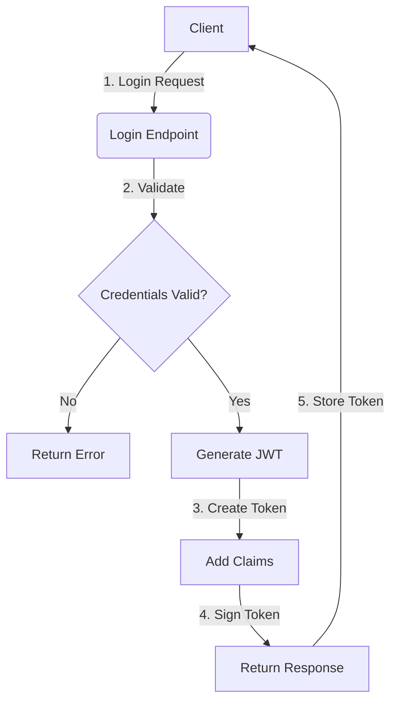
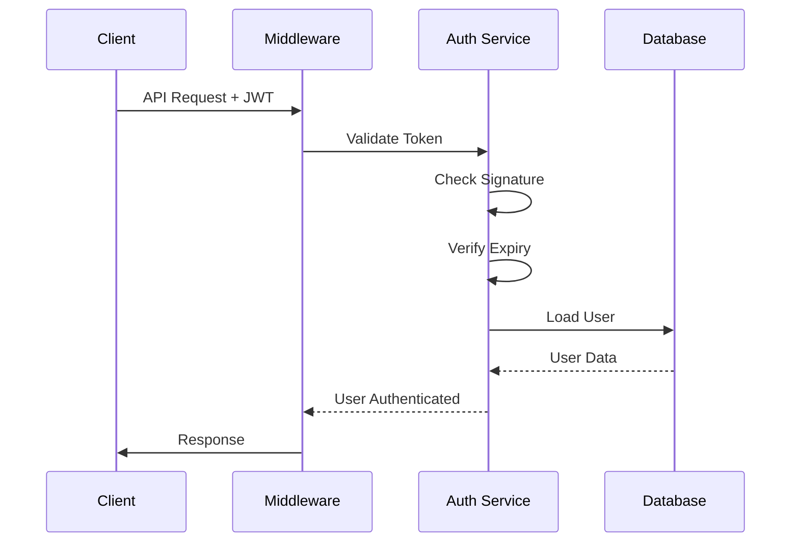
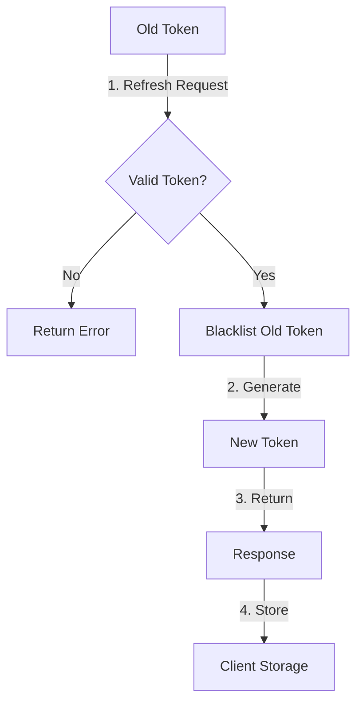
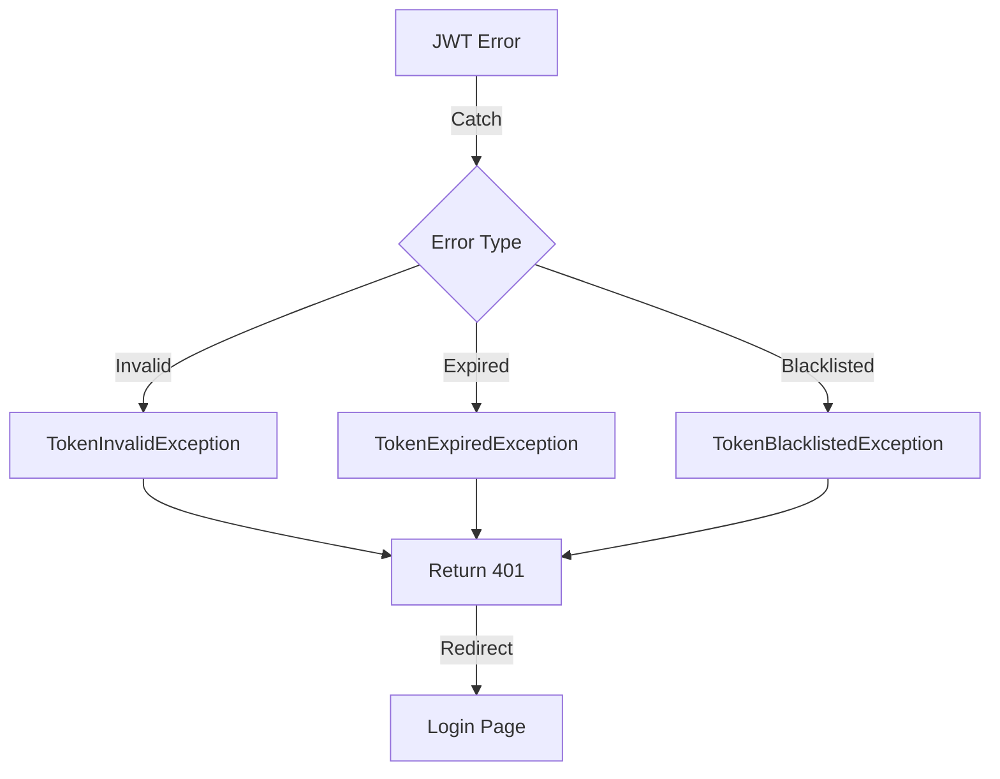
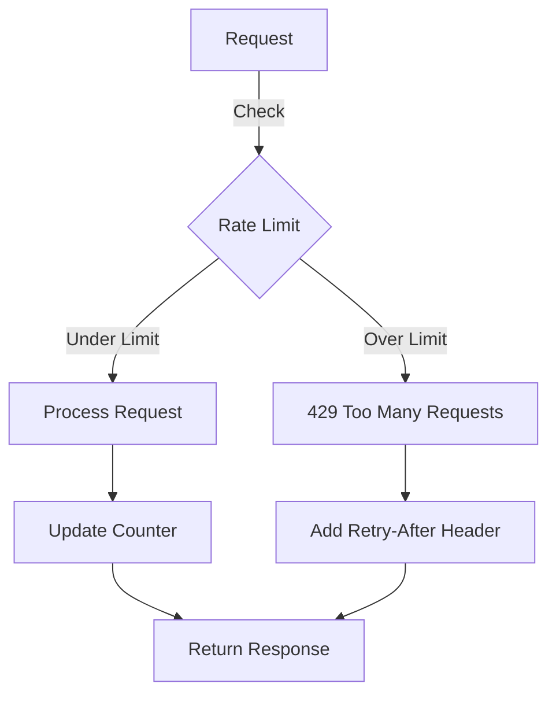

# JWT Token Yaşam Döngüsü Diyagramları

Bu doküman, JWT (JSON Web Token) yaşam döngüsünün farklı aşamalarını görsel olarak açıklar.

## İçindekiler

1. Login Flow
2. Request Flow
3. Token Refresh Flow
4. Error Handling Flow
5. Rate Limiting Flow

## Login Flow

Bu diyagram, kullanıcı girişinden JWT token oluşturulmasına kadar olan süreci gösterir.

## Request Flow

Bu sequence diyagramı, JWT token ile yapılan API isteklerinin nasıl işlendiğini gösterir.

## Token Refresh Flow

Bu diyagram, token yenileme sürecinin nasıl işlediğini gösterir.

## Error Handling Flow

Bu diyagram, JWT ile ilgili hata durumlarının nasıl yönetildiğini gösterir.

## Rate Limiting Flow

Bu diyagram, API isteklerinin nasıl sınırlandırıldığını gösterir.

## Diyagramların Açıklamaları

### Login Flow Detayları

- Client'tan gelen login isteği
- Kimlik bilgilerinin doğrulanması
- JWT token oluşturma ve imzalama
- Response ile token'ın dönülmesi

### Request Flow Detayları

- Client'tan gelen API isteği
- Middleware'de token kontrolü
- Auth service'te token doğrulama
- Kullanıcı bilgilerinin yüklenmesi

### Token Refresh Detayları

- Eski token kontrolü
- Blacklist işlemleri
- Yeni token oluşturma
- Client'a yeni token'ın dönülmesi

### Error Handling Detayları

- Token hatalarının yakalanması
- Hata türüne göre işlem
- Uygun HTTP status code'ları
- Kullanıcı yönlendirme

### Rate Limiting Detayları

- İstek sayısı kontrolü
- Limit aşımı durumu
- Header bilgileri
- Response hazırlama
